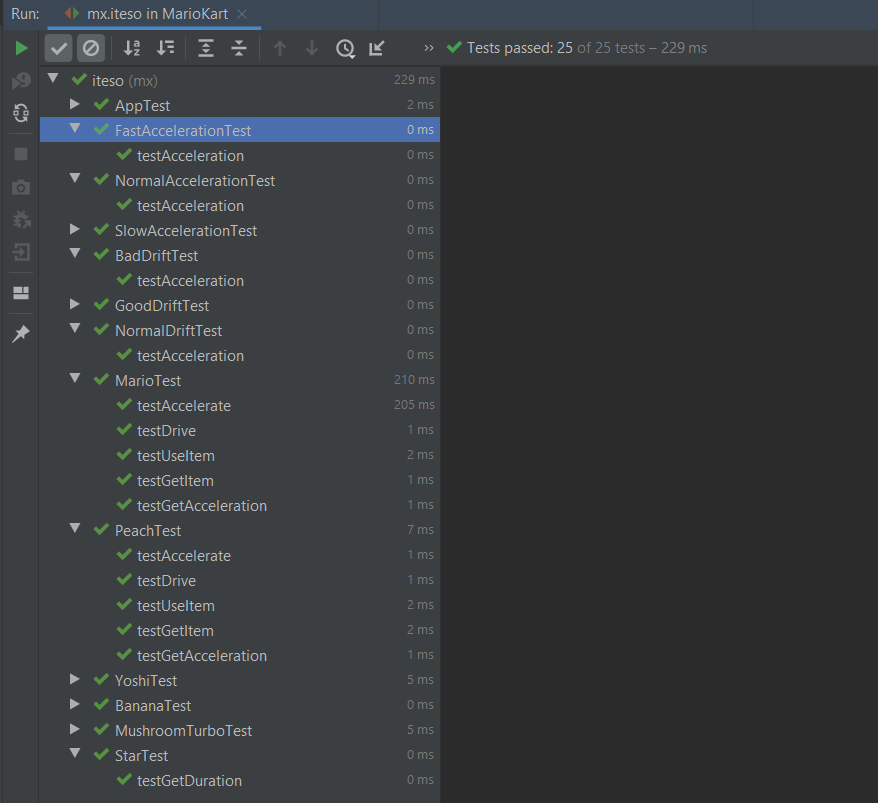

# strategy-practice

* Create the required code to simulate a Mario Kart character acceleration behavior when applying different items that would modify his/her acceleration
* Create an accelerate method that would act differently depending on the item applied

* Repeat the exercise for drifting behavior 
* Create unit tests for each of your concrete clases
* Run checkstyle and pmd tools for 0 errors

*Here is the succesful run of all the unit test.

*Here is the checkstyle with 0 errors